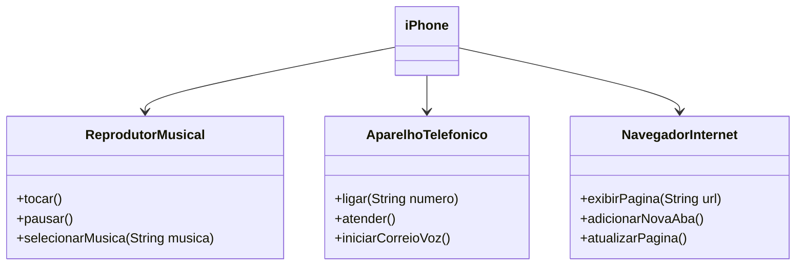

# 📱 Desafio DIO - Componente iPhone

Este projeto implementa a modelagem de um iPhone com suas 3 principais funcionalidades:

- 🎵 [Reprodutor Musical](https://github.com/arthurcarneiro1/trilha-java-basico/blob/main/poo/ReprodutorMusical.java) 
- 📞 [Aparelho Telefônico](https://github.com/arthurcarneiro1/trilha-java-basico/blob/main/poo/AparelhoTelefonico.java) 
- 🌐 [Navegador de Internet](https://github.com/arthurcarneiro1/trilha-java-basico/blob/main/poo/NavegadorInternet.java)  

## 📊 Diagrama UML



## 📁 Estrutura

```
ReprodutorMusical.java  
AparelhoTelefonico.java  
NavegadorInternet.java  
iPhone.java
```
