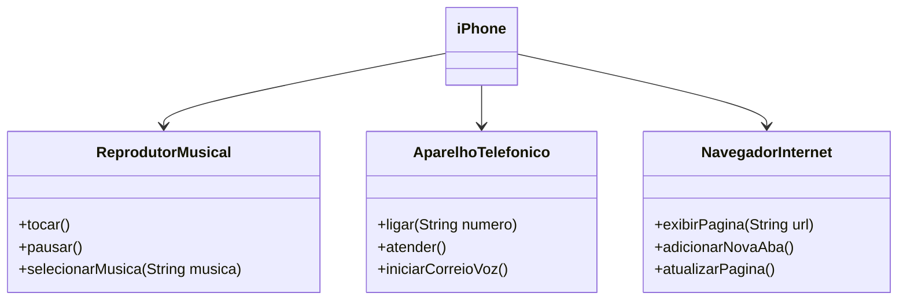

# 📱 Desafio DIO - Componente iPhone

Este projeto implementa a modelagem de um iPhone com suas 3 principais funcionalidades:

- 🎵 Reprodutor Musical  
- 📞 Aparelho Telefônico  
- 🌐 Navegador de Internet  

## 📊 Diagrama UML



## 📁 Estrutura

```
ReprodutorMusical.java  
AparelhoTelefonico.java  
NavegadorInternet.java  
iPhone.java
```

## ✅ Requisitos Atendidos

- [x] Diagramar em UML
- [x] Criar interfaces
- [x] Implementar classe `iPhone`